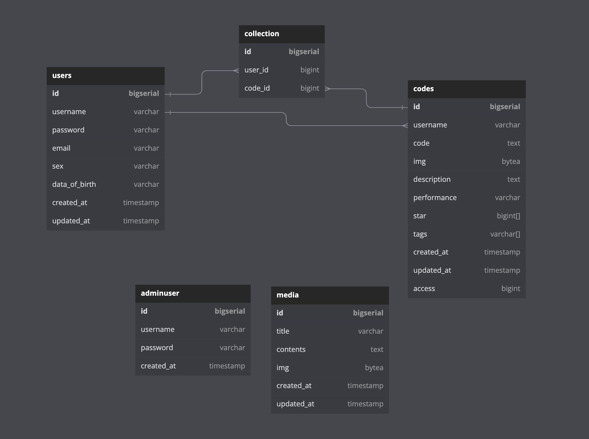

command-style
<code></code>
<code></code>

- log in
- log out
- cookie
- auth
- manage

- authenticate
- bearer
- paseto
- hash value

- SPA
- Next js
- SSG, SSR

- GraphQL
- codegen
- react-query

- golang
- gqlgen
- dataloader
- gin
- middleware
- sqlc -> auto ORM
- sql-migrate -> auto migration
- mock + sqlc -> auto generate

- redis
- store auth info

- postgres
- db design

- typescript
- golang
- SQL
- terraform
- github
- github actions
- docker
- docker-compose
- AWS

- frontend
  React - Next.js
  sass - scss
  react-query
  recoil
  material ui
  story-book
  jest
  eslint
  prettier

- API
  GraphQL
  codegen

- backend
  Go (gqlgen, dataloader, gin, sqlc, colly)

- database
  postgres (pgx/v4, dataloader, zerolog)
  redis

- infra
  AWS (EC2, ECS, ALB)
  terraform
  docker

- Saas
  github
  github actions
  circle CI

**architecture**

- MVC

  - frontend
    model:
    view:
    controller:

  - backend
    model: db, token, config, colly -> graph server gin handler
    view: resolver
    controller: graph server
